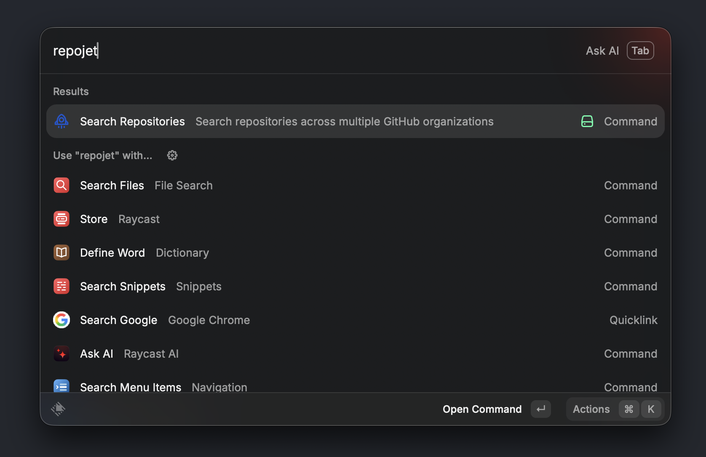
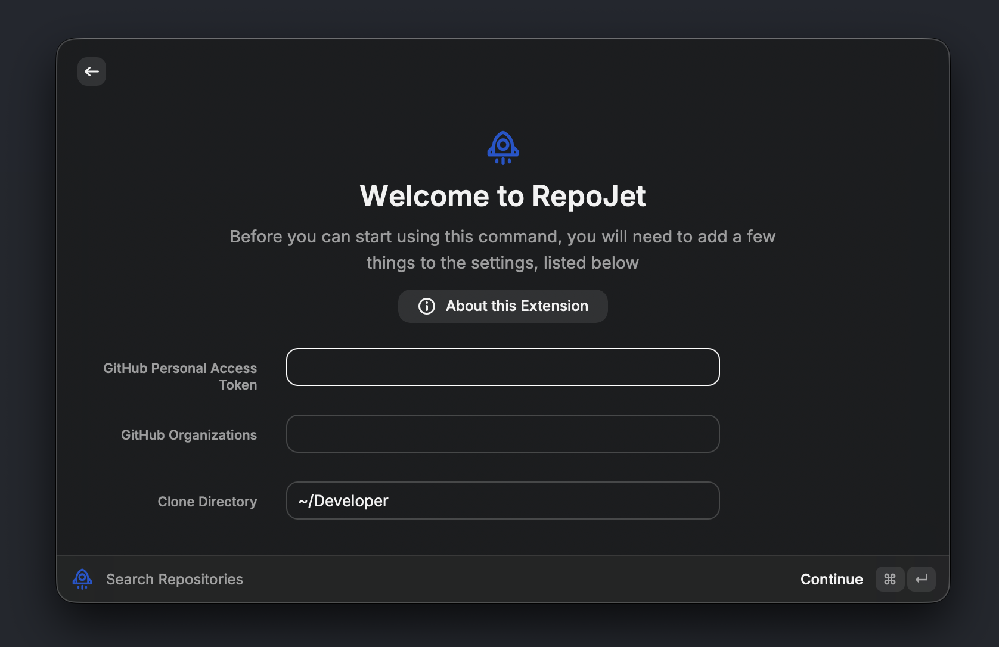
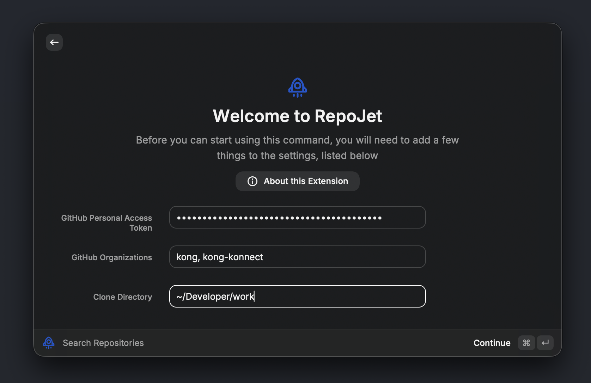
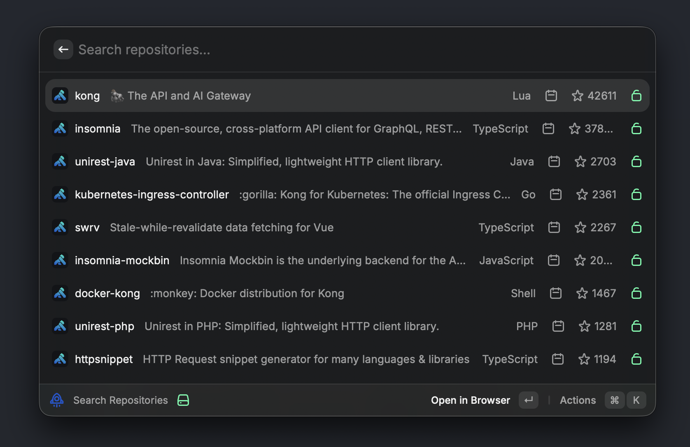
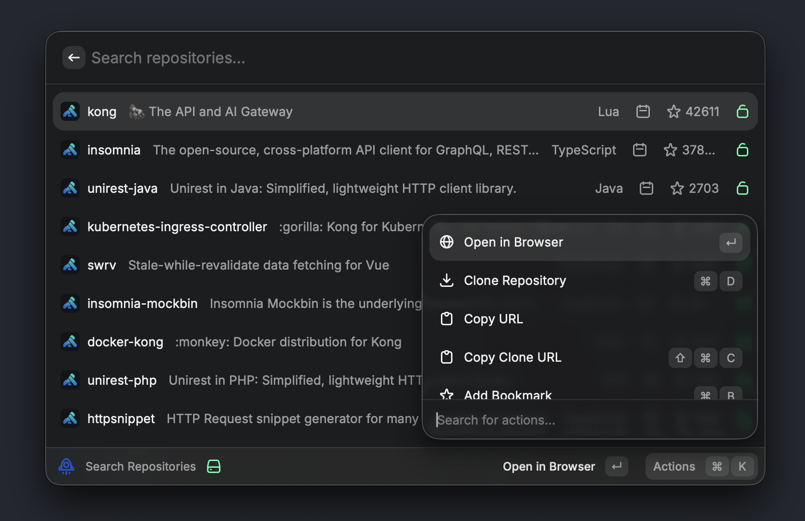

# RepoJet

Search repositories across multiple GitHub organizations directly from Raycast.

- [Screenshots](#screenshots)
- [Features](#features)
- [Setup](#setup)
  - [1. Install the Extension](#1-install-the-extension)
  - [2. Configure GitHub Token (Optional but Recommended)](#2-configure-github-token-optional-but-recommended)
  - [3. Add Organizations](#3-add-organizations)
  - [4. Start Searching](#4-start-searching)
- [Usage](#usage)
- [Repository Aliases](#repository-aliases)
- [Keyboard Shortcuts](#keyboard-shortcuts)
- [Authentication](#authentication)
- [Example Queries](#example-queries)
- [Rate Limiting](#rate-limiting)
- [Releases](#releases)
- [Troubleshooting](#troubleshooting)

## Screenshots

<table>
  <tr>
    <td align="center" style="background-color: #23272D;">
      <br/>
      <em>RepoJet</em>
    </td>
    <td align="center" style="background-color: #23272D;">
      <br/>
      <em>Finding the extension</em>
    </td>
  </tr>
  <tr>
    <td align="center" style="background-color: #23272D;">
      <br/>
      <em>Initial setup</em>
    </td>
    <td align="center" style="background-color: #23272D;">
      <br/>
      <em>Configuration</em>
    </td>
  </tr>
  <tr>
    <td align="center" style="background-color: #23272D;">
      <br/>
      <em>Repository list</em>
    </td>
    <td align="center" style="background-color: #23272D;">
      <br/>
      <em>Search results</em>
    </td>
  </tr>
  <tr>
    <td align="center" style="background-color: #23272D;">
      <br/>
      <em>Bookmarked repos</em>
    </td>
    <td align="center" style="background-color: #23272D;">
      <br/>
      <em>Actions menu</em>
    </td>
  </tr>
  <tr>
    <td align="center" style="background-color: #23272D;">
      <br/>
      <em>Clone success</em>
    </td>
    <td align="center" style="background-color: #23272D;">
      <br/>
      <em>Invalid token</em>
    </td>
  </tr>
  <tr>
    <td align="center" style="background-color: #23272D;">
      <br/>
      <em>No results</em>
    </td>
    <td align="center" style="background-color: #23272D;">
      <br/>
      <em>Error state</em>
    </td>
  </tr>
</table>

## Features

- **Search repositories** across multiple GitHub organizations
- **Bookmark repositories** to keep them at the top of your list
- **Repository aliases** - set custom short names for quick access (e.g., "gh" for "your-github-repository-with-a-long-name")
- **Clone repositories** directly to your local machine with one command
- **Customizable clone directory** - choose where repos are cloned
- Support for private repositories with GitHub Personal Access Token
- Real-time search with instant results
- Quick access to repository URLs and clone commands

## Setup

### 1. Install the Extension

**Option 1: Official Extension (Private)**

This extension is currently available as a private extension at [https://www.raycast.com/konghq/repojet](https://www.raycast.com/konghq/repojet). If you have access, you can install it directly from the Raycast Store.

**Option 2: Local Installation**

For local development or if you don't have access to the private extension:

1. Download the latest release from the [Releases page](https://github.com/arashsheyda/repojet/releases)
2. Extract the downloaded archive
3. In Raycast, use the "Import Extension" command
4. Navigate to the extracted folder and select it
5. The extension will be installed and ready to use

**Option 3: Build from Source**

```bash
# Clone the repository
git clone https://github.com/arashsheyda/repojet.git
cd repojet

# Install dependencies
npm install

# Build the extension
npm run build

# Import into Raycast
# Use Raycast's "Import Extension" command and select this directory
```

### 2. Configure GitHub Token (Optional but Recommended)

To access private repositories and increase API rate limits:

1. Go to [GitHub Settings > Developer settings > Personal access tokens > Tokens (classic)](https://github.com/settings/tokens)
2. Click "Generate new token (classic)"
3. Give it a descriptive name like "Raycast RepoJet Extension"
4. Select the `repo` scope, this grants:
   - Full control of private repositories (read access)
   - Access to repository metadata
   - Read access to organization repositories
5. Set an appropriate expiration date (recommended: 90 days or less for security)
6. Click "Generate token" at the bottom
7. **Important**: Copy the token immediately - you won't be able to see it again!
8. **For SSO-enabled organizations**: After creating the token, you must authorize it for each organization:
   - Go to [Personal Access Tokens](https://github.com/settings/tokens)
   - Click on your newly created token
   - Under "Configure SSO", click **Authorize** next to each organization you want to search
   - This step is required for accessing repositories in organizations with SAML SSO enabled

**Security Note**: This extension only requires read access. The token validation will reject tokens with dangerous write/admin scopes like `delete_repo`, `workflow`, `admin:org`, or `write:repo_hook`.

### 3. Add Organizations

1. Open Raycast
2. Search for "GitHub Organization Search" → "Search Repositories"
3. If not configured, you'll see setup instructions
4. Open Preferences (⌘,)
5. Paste your GitHub token in "GitHub Personal Access Token"
6. Enter your organization names (comma-separated) in "GitHub Organizations"
   - Example: `myorg1, myorg2, personal-org`
7. (Optional) Set your preferred "Clone Directory" for cloning repositories
   - Default: `~/Developer`
   - You can use paths like `~/Projects`, `~/Code`, or any absolute path

### 4. Start Searching

Search for repositories by name, description, or language!

## Usage

1. Open Raycast (default: `⌘Space`)
2. Type "Search Repositories" and hit Enter
3. Type to search (e.g., "react", "api", "database", or your custom aliases)
4. Results show:
   - Repository name and description
   - Star count
   - Programming language
   - Privacy status (if private)
   - Bookmark indicator (yellow star) for bookmarked repos
   - Alias badge (purple tag) if you've set a custom alias
5. Available actions:
   - **Enter** - Open repository in browser
   - **⌘D** - Clone repository to your configured directory
   - **⌘B** - Bookmark/unbookmark repository (bookmarked repos stay at the top)
   - **⌘L** - Set or edit repository alias
   - **⌘⇧L** - Remove repository alias
   - **⌘C** - Copy repository URL
   - **⌘⇧C** - Copy git clone URL

## Repository Aliases

Create custom short names for repositories to find them quickly:

### Setting an Alias
1. Find the repository you want to alias
2. Press **⌘L** or select "Set Alias" from the actions menu
3. Enter a short name (e.g., "lln" for "long-long-name")
4. Press Enter to save

### Using an Alias
Simply type the alias in the search bar. The repository will be found and prioritized in the results.

**Example:**
- Repository: `my-organization/very-long-repository-name`
- Set alias: `vlrn`
- Search: Type `vlrn` to quickly find this repo

### Managing Aliases
- **Edit**: Press **⌘L** on a repository with an existing alias to change it
- **Remove**: Press **⌘⇧L** to delete the alias
- **Visual indicator**: Repositories with aliases show a purple badge with the alias name

Aliases are stored locally and work offline. They complement bookmarks by providing quick text-based access.

## Keyboard Shortcuts

- **⌘D** - Clone repository to local machine
- **⌘B** - Toggle bookmark (keeps repos at the top)
- **⌘L** - Set or edit repository alias
- **⌘⇧L** - Remove repository alias
- **⌘C** - Copy repository URL
- **⌘⇧C** - Copy git clone URL
- **⌘,** - Open preferences

## Authentication

The extension uses GitHub's REST API v3. Authentication is optional but recommended:

- **Without token**: Limited to public repositories, 60 requests/hour
- **With token (classic PAT)**: Access to private repositories, 5,000 requests/hour

### Token Requirements
- Must be a **Personal Access Token (classic)**
- Required scope: `repo` (for private repository access)
- Token will be validated for security - tokens with dangerous write/admin scopes will be rejected

## Example Queries

- `react` - Find React-related repositories
- `database` - Find database-related repositories
- `language:python` - Find Python repositories
- `stars:>1000` - Find popular repositories
- `is:private` - Find private repositories (requires token)
- `gh` - Search using your custom alias (e.g., if you set "gh" as an alias for "your-github-repository-with-a-long-name")

## Rate Limiting

GitHub API has rate limits:
- Without token: 60 requests/hour
- With token: 5,000 requests/hour

The extension caches results, so repeated searches are instant.

## Releases

### Automatic Releases with Conventional Commits

This project uses [Conventional Commits](https://www.conventionalcommits.org/) for automatic versioning and releases. When you push commits to the `main` branch, the release workflow automatically:

1. Analyzes your commit messages
2. Determines the appropriate version bump
3. Updates `package.json`
4. Creates a git tag
5. Builds and publishes a GitHub release

### Downloading Releases

Visit the [Releases page](https://github.com/arashsheyda/repojet/releases) to download the latest version for local installation.

## Troubleshooting

### No results found
- Check that your organizations are spelled correctly
- Ensure the GitHub token is valid (if using private repos)
- Try simpler search terms

### "API rate limit exceeded"
- Add a GitHub Personal Access Token to increase limits
- Wait an hour for the limit to reset

### Can't access private repositories
- Ensure your token is a **Personal Access Token (classic)** with `repo` scope
- **For SSO organizations**: Make sure you've authorized the token for SSO access to each organization (see step 8 in setup)
- Token might have expired (regenerate if needed)
- Check that you have access to the organizations you're searching
