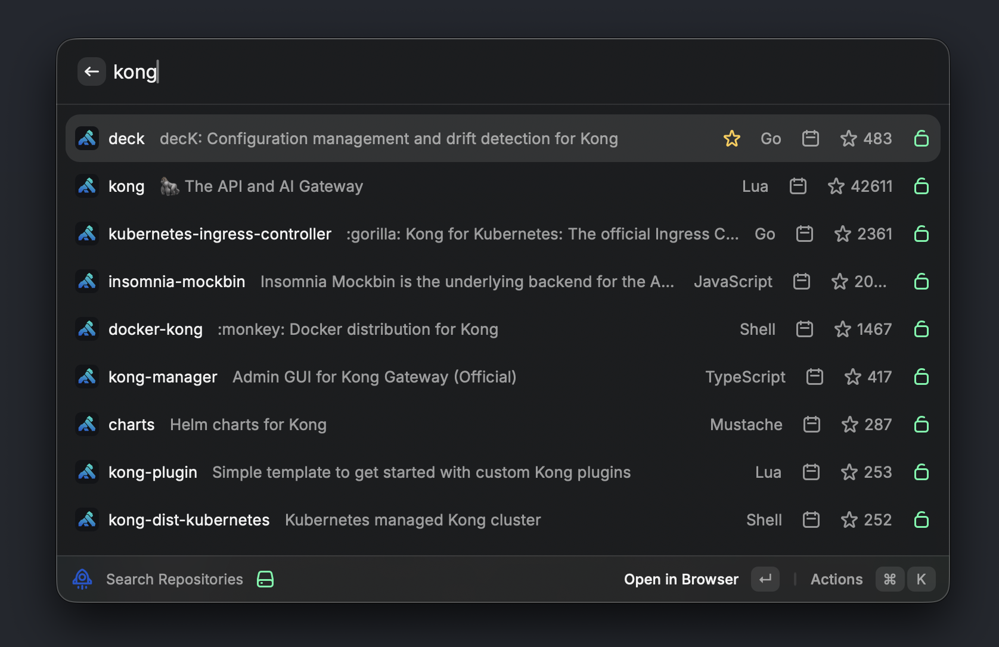
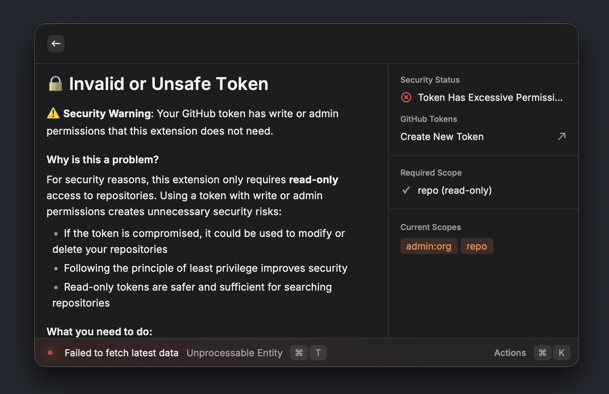
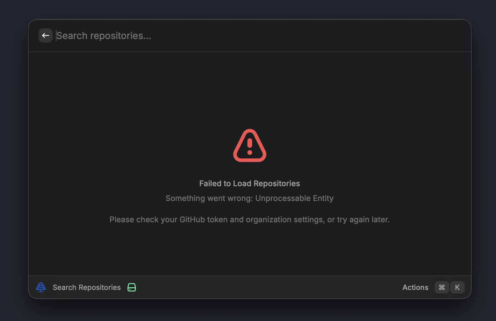

# Kong Ray

Search repositories across multiple GitHub organizations directly from Raycast.

!IMPORTANT: the PAT is only working for 1 org so we need to refactor and go with "GitHub App"

## Screenshots

<table>
  <tr>
    <td></td>
    <td></td>
  </tr>
  <tr>
    <td></td>
    <td></td>
  </tr>
  <tr>
    <td></td>
   <td></td>
  </tr>
  <tr>
    <td></td>
    <td></td>
  </tr>
</table>

## Features

- Search repositories across multiple GitHub organizations
- Support for private repositories with GitHub Personal Access Token
- Real-time search with instant results
- Quick access to repository URLs

## Setup

### 1. Install the Extension

The extension is located in the `raycast-extension` directory.

### 2. Configure GitHub Token (Optional but Recommended)

To access private repositories and increase API rate limits:

1. Go to [GitHub Settings > Developer settings > Personal access tokens](https://github.com/settings/tokens)
2. Click "Generate new token (classic)"
3. Give it a name like "Raycast Extension"
4. Select the `repo` scope (full control of private repositories)
5. Generate the token and copy it

### 3. Add Organizations

1. Open Raycast
2. Search for "GitHub Organization Search" → "Search Repositories"
3. If not configured, you'll see setup instructions
4. Open Preferences (⌘,)
5. Paste your GitHub token in "GitHub Personal Access Token"
6. Enter your organization names (comma-separated) in "GitHub Organizations"
   - Example: `myorg1, myorg2, personal-org`

### 4. Start Searching

Search for repositories by name, description, or language!

## Usage

1. Open Raycast (default: `⌘Space`)
2. Type "Search Repositories" and hit Enter
3. Type to search (e.g., "react", "api", "database")
4. Results show:
   - Repository name and description
   - Star count
   - Programming language
   - Privacy status (if private)
5. Press Enter to open in browser
6. Press ⌘C to copy the repository URL

## Authentication

The extension uses GitHub's REST API v3. Authentication is optional but recommended:

- **Without token**: Limited to public repositories, 60 requests/hour
- **With token**: Access to private repositories, 5,000 requests/hour

## Example Queries

- `react` - Find React-related repositories
- `database` - Find database-related repositories
- `language:python` - Find Python repositories
- `stars:>1000` - Find popular repositories
- `is:private` - Find private repositories (requires token)

## Rate Limiting

GitHub API has rate limits:
- Without token: 60 requests/hour
- With token: 5,000 requests/hour

The extension caches results, so repeated searches are instant.

## Troubleshooting

### No results found
- Check that your organizations are spelled correctly
- Ensure the GitHub token is valid (if using private repos)
- Try simpler search terms

### "API rate limit exceeded"
- Add a GitHub Personal Access Token to increase limits
- Wait an hour for the limit to reset

### Can't access private repositories
- Ensure your token has `repo` scope
- Token might have expired (regenerate if needed)
